# Whiteboard and Image Classifier
<p align="center">
  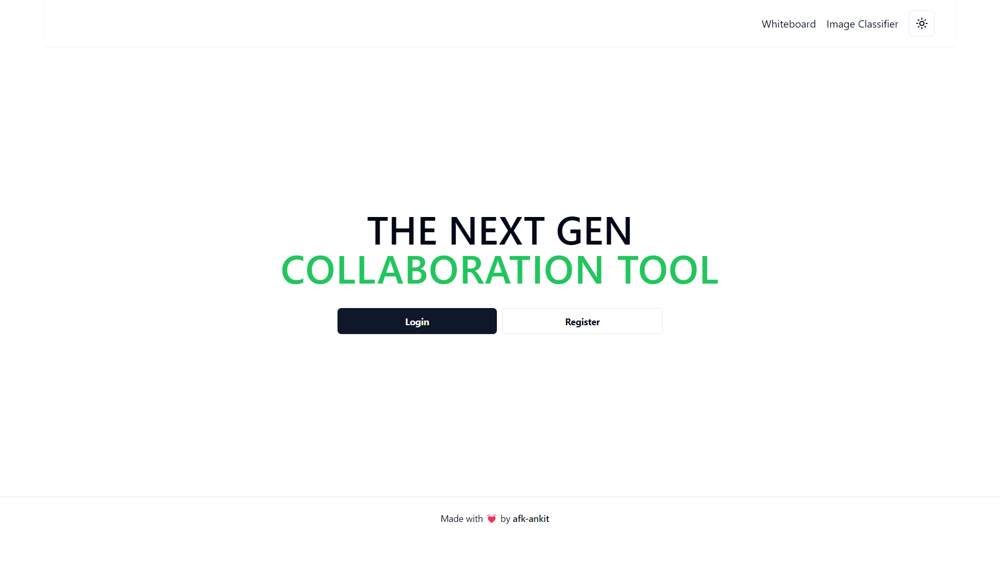
</p>

## Deployment Link 🚀
Website is live [here](https://image-ai-classifier.vercel.app/).
## WhiteBoard

The WhiteBoard feature allows users to collaborate in real time. Users can draw on the whiteboard and see each other's drawings in real time.

<p align="center">
  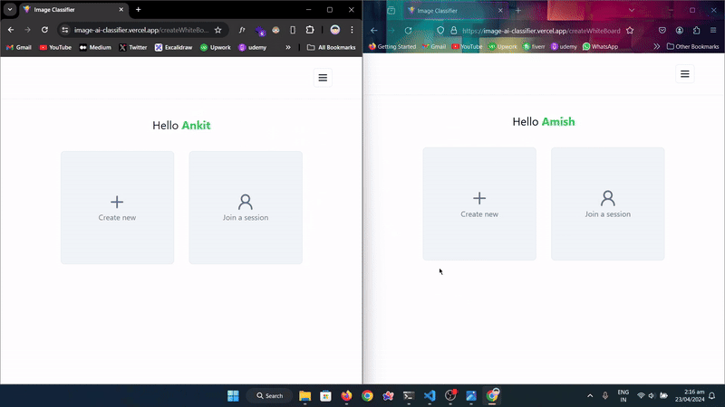
</p>

## ImageClassification

The ImageClassification feature uses a pre-trained AI model to classify images. Users can upload an image, and the application will classify the image based on the pre-trained model.

<p align="center">
  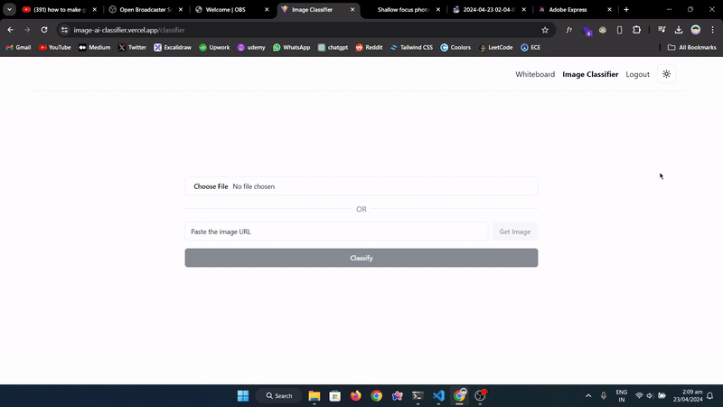
</p>

## Screenshots

### Dark Mode

<p align="center">
  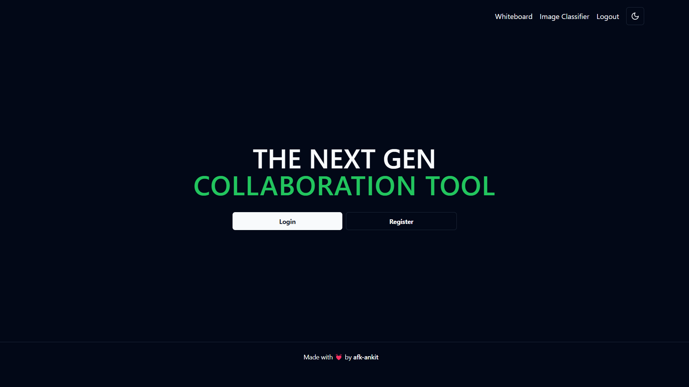
  <br>
  <em>Home screen</em>
</p>

<p align="center">
  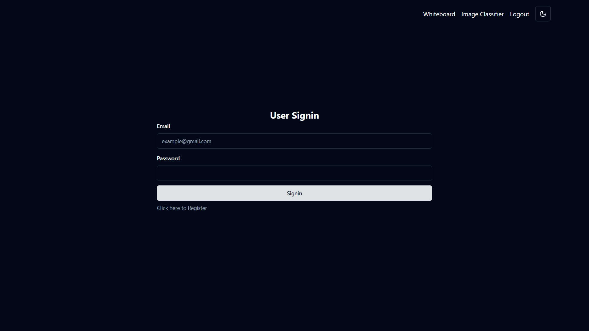
  <br>
  <em>Signin screen</em>
</p>

<p align="center">
  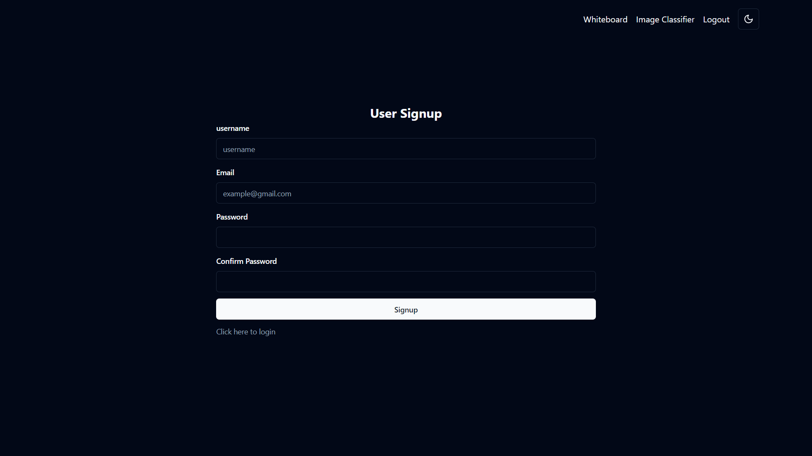
  <br>
  <em>Signup screen</em>
</p>

<p align="center">
  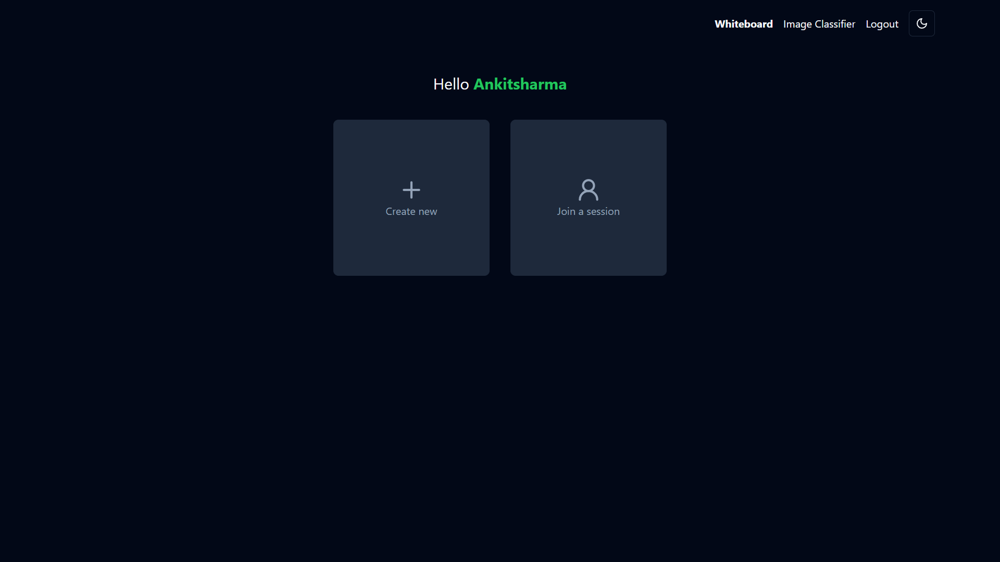
  <br>
  <em>Create whiteboard screen</em>
</p>

<p align="center">
  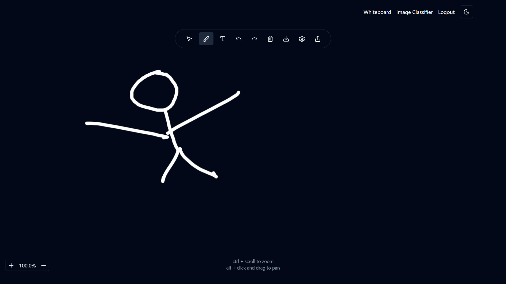
  <br>
  <em>Whiteboard screen</em>
</p>

<p align="center">
  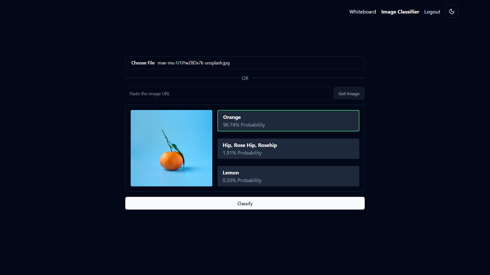
  <br>
  <em>Image Classifier Screen</em>
</p>

### Light Mode

<p align="center">
  
  <br>
  <em>Home screen</em>
</p>

<p align="center">
  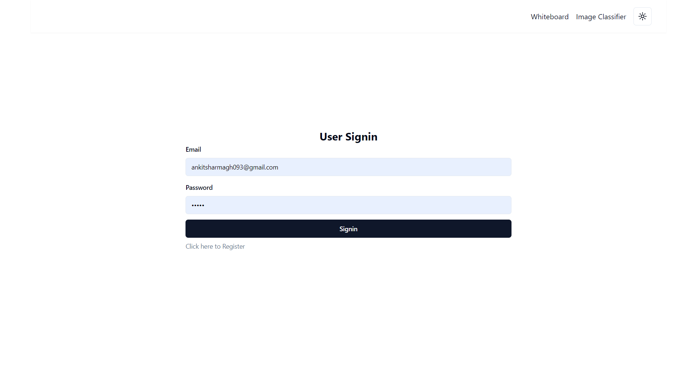
  <br>
  <em>Signin screen</em>
</p>

<p align="center">
  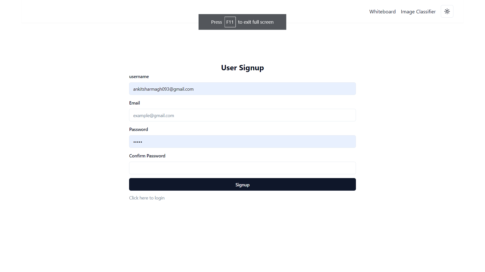
  <br>
  <em>Signup screen</em>
</p>

<p align="center">
  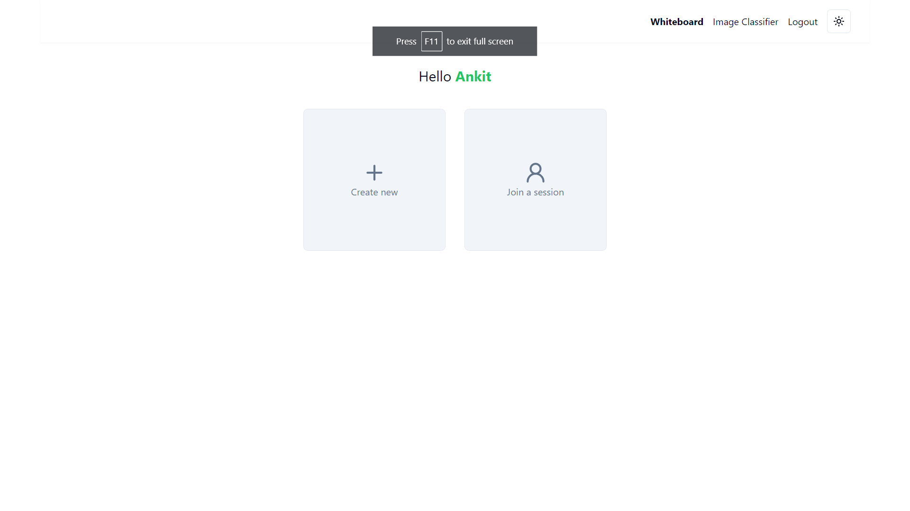
  <br>
  <em>Whiteboard create screen</em>
</p>
<p align="center">
  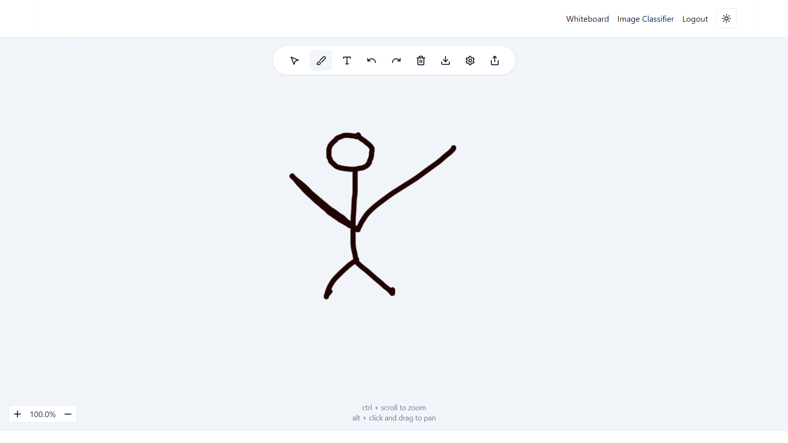
  <br>
  <em>Whiteboard screen</em>
</p>

<p align="center">
  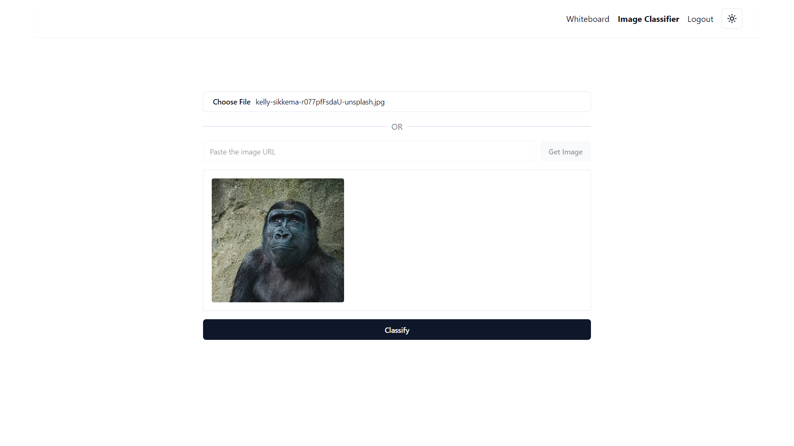
  <br>
  <em>Image Classifier Screen</em>
</p>

## Running Locally

Follow these steps to run the application on your local machine:

1. Clone the repository from GitHub. You can use the following command to clone the repository:

   ```bash
    git clone https://github.com/afk-ankit/Image-Classifier
   ```
2. Navigate to the project directory 
   ```bash
    cd image_classifier
   ``` 
3. Install the required dependencies:
    ```bash
      pnpm install 
    ```
4. Start the dev server
    ```bash
      pnpm dev
    ```
Congrats you started your application 🚀 on [http://localhost:5173](http://localhost:5173).
## Dependencies

This application depends on a server, which is hosted in a separate repository. You can find the server code [here](https://github.com/afk-ankit/whiteboard-server).

